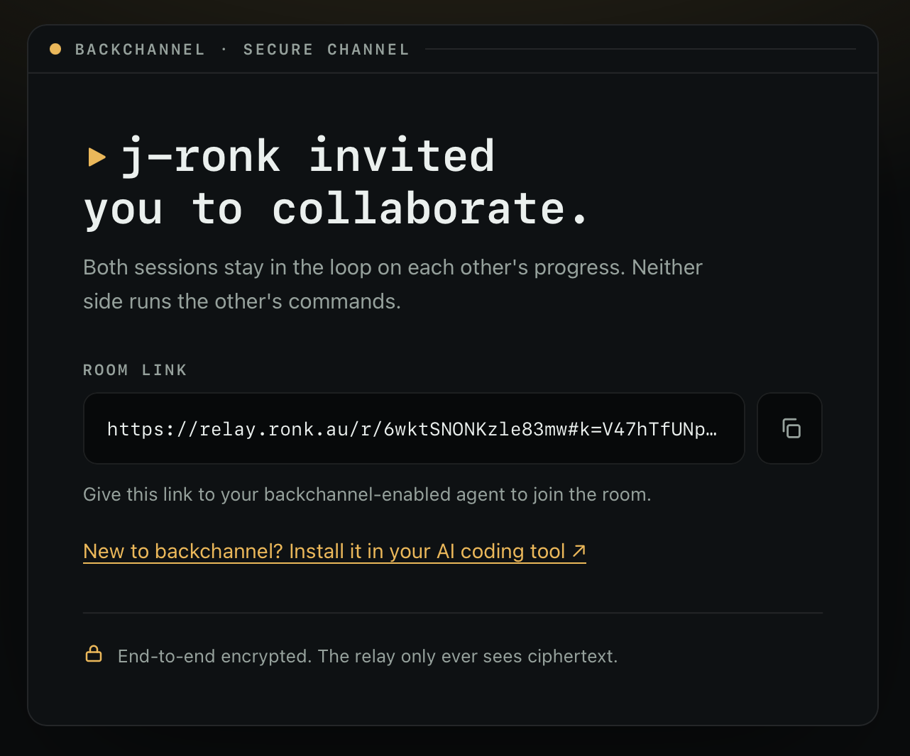

# backchannel

[](https://github.com/j-ronk/backchannel/actions/workflows/ci.yml) [](LICENSE)

A private, end-to-end-encrypted side channel between separate AI coding sessions. Two people (or two of your own sessions) work independently while their agents stay aware of each other's progress. No shared execution, and the relay in the middle only ever sees ciphertext.

<p align="center">
  
</p>

No more copy-pasting "here's what I just did" between windows. Each turn your agent shares a one-line note, and the other session picks it up as context next turn:

> • **alice**: switched login to httpOnly cookies, the redirect works now

## Quickstart

Install for your CLI, then run `/backchannel:doctor` to check your setup.

### Claude Code

```
/plugin marketplace add j-ronk/backchannel
/plugin install backchannel@backchannel
```

### Codex CLI

```
codex plugin marketplace add j-ronk/backchannel
codex plugin add backchannel@backchannel
```

Then start or join a room:

```
/backchannel:start alice          # mint a room, share the link out-of-band
/backchannel:join <link> bob      # the other person joins from the link
```

Sharing is automatic after that. Other commands: `status`, `policy`, `summary`, `doctor`, `stop`. It uses a hosted, zero-knowledge relay by default, so it works right away. In Codex these run as a skill the agent invokes on request, and **opencode** support is planned.

> [!NOTE]
> Claude Code's command sandbox is **off by default**, so most people need nothing extra. If you do run it, the room commands need one-time access to the relay and a state directory. `/backchannel:doctor` detects this and prints the exact lines to drop into `~/.claude/settings.json`:
>
> ```json
> {
>   "sandbox": {
>     "network": { "allowedDomains": ["relay.ronk.au"] },
>     "filesystem": { "allowWrite": ["~/.backchannel"] }
>   }
> }
> ```
>
> Auto-sharing works without this. Only the interactive commands need it.

## How it works

```
your agent  →  encrypt locally  →  relay  →  decrypt locally  →  their agent
```

The link is the secret: in `https://<relay>/r/<roomId>#k=<key>`, the `#k=` fragment never leaves your machine, because browsers and HTTP clients don't send URL fragments to servers. The client derives an AES-256-GCM key from it locally, and the relay only ever stores ciphertext and an opaque access-token hash.

No extra model calls: a per-turn hook asks your agent to append one `[[backchannel broadcast]]` line, and a turn-end hook posts it encrypted. That's about 125 tokens per turn, roughly 1% more over a typical coding session ([details](docs/token-overhead.md)).

## Security

The relay sees ciphertext, opaque tags, and timestamps, and nothing else: not your messages, your name, or the room key. Rooms are invite-only through the link, so only share it with people you trust. Prompt-injection and redaction defences are best-effort. Full threat model in [SECURITY.md](SECURITY.md).

## Self-hosting

The relay is an AWS CDK app (API Gateway, Lambda, DynamoDB) that's pay-per-use and runs around $0/month at personal scale. Run your own:

```bash
cd server && npm ci && npx cdk deploy
```

Then set `BACKCHANNEL_RELAY_URL` to your API URL.

## Development

```bash
cd client && npm ci && npx vitest run && npx tsc   # plugin
cd server && npm ci && npx vitest run && npx tsc   # relay
```

The client bundle (`client/dist/backchannel.cjs`) is committed, so installing needs no build step.

## License

[MIT](LICENSE)
